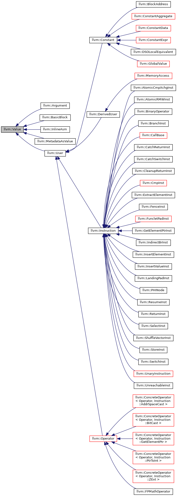
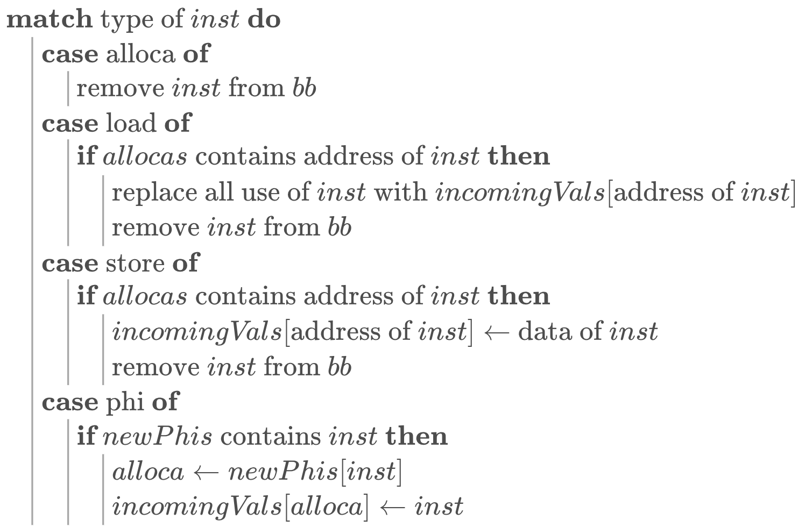

# 编译器设计文档

> 姓名：严皓钧
>
> 学号：21371372

## 1.参考编译器介绍

​	在本部分中，我将pascals-compiler 编译器作为参考编译器，并对该编译器的总体架构、接口设计以及文件组织进行分析。

### 1.1. 总体架构

#### 1.1.1. 编译阶段

- **词法分析**：通过`insymbol`函数实现，用于识别源代码中的符号（tokens），例如关键字、运算符、标识符等。
- **语法分析**：在`block`函数中实现，这部分代码负责根据Pascal语言的语法规则解析词法单元，构建语法结构。该函数递归地调用自身来处理嵌套的结构，如函数和过程定义。
- **符号表管理**：通过`tab`, `btab`, `atab`等数组实现，用于存储变量、常量、过程和函数的信息。符号表是pascals-compiler编译器中一个重要的数据结构，用于在编译过程中跟踪标识符和它们的属性。


#### 1.1.2. 解释执行

- **生成中间代码**：编译阶段生成的中间代码存储在`code`数组中，`code`数组是一个指令序列，每个指令包括操作码和操作数。
- **解释执行**：`interpret`函数对中间代码进行解释执行。这个过程模拟了一个虚拟机，按照中间代码指令操作，包括算术运算、控制流指令等。


### 1.2. 接口设计

- **模块化设计**：代码中的功能被划分为多个子程序（如`enter`, `insymbol`, `interpret`），每个子程序负责特定的任务，有助于代码的组织和维护，符合面向对象设计思想。
- **数据访问**：通过全局变量和数组（如`symset`, `tab`）进行数据交换，在这个编译器的上下文中简化了数据共享。
- **错误处理**：通过`error`函数进行错误处理，显示错误消息，并在`errs`集合中记录错误。


### 1.3. 文件组织

- **单文件结构**：本编译器的所有代码都在一个文件中，对于大型项目来说，此种组织形式较难进行特定代码的定位，并且较难进行迭代开发．
- **代码顺序**：按照编译过程的顺序组织代码，从词法分析到解释执行，使得阅读和理解整个编译过程较为直观。


## 2.编译器总体设计

### 2.1 总体架构

​	总体来看，编译器主要分为以下四个部分：

- **前端**：前端主要负责词法分析与语法分析，对源代码进行初步的处理转换为抽象语法树。
- **中端**：中端主要负责对前端生成的抽象语法树生成为对应的LLVM中间代码以及中端优化。
- **后端**：后端主要负责将中间代码翻译为MIPS代码并且进行后端优化。
- **错误处理**：错误处理部分主要在语法分析部分中识别程序中的词法错误、语法错误等，并报告错误信息。


### 2.2 接口设计

#### 2.2.1 前端

- Token与TokenCode：词法分析中的词与词的类型

- Symbol ：前端分析时的符号与符号表

- ASTNode：抽象语法树结点，是对语法分析时不同语法成分的封装
- Lexer：词法分析器，基于有限自动状态机对源程序进行词法分析
- Parser：语法分析器，基于递归下降对token进行分析，获得抽象语法树。

#### 2.2.2 中端

- optimize：中端优化部分，包含了实现的对中端的数据流分析以及优化
- types：类型系统，包含了LLVM中的数据类型
- values：LLVM中的value系统，包含instruction、use、user、Const等，其中use主要用于优化部分。
- IRBuilder：工厂模式，用于生成中间代码
- Visitor：访问者模式，用于递归下降再次分析抽象语法树，从而生成中间代码。

#### 2.2.3 后端

- Components：包含insturctions、MipsBasicBlock,MipsFunction, MipsGlobalVariable 以及MipsModule，作为mips代码的组件。
- Operands：包含Register、Label以及Imm，Mips指令中的操作数
- Maneger：主要包含RegisterManeger和StackManeger，分别用于管理寄存器分配和栈空间分配的记录。

#### 2.2.4 错误处理

- Error与ErrorType：错误类与错误类型
- ErrorHandler：对不同错误类型进行处理并记录的类。


### 2.3 文件组织

​	编译器的文件组织大致上与编译器的架构设计保持一致，也分为前端、中端、后端以及错误处理。具体的文件组织树形结构如下：

```
├── Compiler.java
├── Error
│   ├── Error.java
│   ├── ErrorHandler.java
│   └── ErrorType.java
├── backend
│   ├── Components
│   │   ├── MipsBasicBlock.java
│   │   ├── MipsFunction.java
│   │   ├── MipsGlobalVariable.java
│   │   ├── MipsModule.java
│   │   └── instrutions
│   │       ├── MIPSJal.java
│   │       ├── MipsAddi.java
│   │       ├── MipsAddu.java
│   │       ├── MipsBeq.java
│   │       ├── MipsComment.java
│   │       ├── MipsDiv.java
│   │       ├── MipsInstruction.java
│   │       ├── MipsInstructionType.java
│   │       ├── MipsJ.java
│   │       ├── MipsJr.java
│   │       ├── MipsLa.java
│   │       ├── MipsLi.java
│   │       ├── MipsLw.java
│   │       ├── MipsMfhi.java
│   │       ├── MipsMflo.java
│   │       ├── MipsMove.java
│   │       ├── MipsMulu.java
│   │       ├── MipsSeq.java
│   │       ├── MipsSge.java
│   │       ├── MipsSgt.java
│   │       ├── MipsSle.java
│   │       ├── MipsSll.java
│   │       ├── MipsSlt.java
│   │       ├── MipsSne.java
│   │       ├── MipsSubu.java
│   │       ├── MipsSw.java
│   │       └── MipsSyscall.java
│   ├── Maneger
│   │   ├── MipsSymbol.java
│   │   ├── RegisterManager.java
│   │   └── StackManager.java
│   ├── MipsGenerator.java
│   └── Operands
│       ├── Imm.java
│       ├── Label.java
│       └── Register.java
├── frontend
│   ├── ASTNode
│   │   ├── AddExpNode.java
│   │   ├── BTypeNode.java
│   │   ├── BlockItemNode.java
│   │   ├── BlockNode.java
│   │   ├── CompUnitNode.java
│   │   ├── CondNode.java
│   │   ├── ConstDeclNode.java
│   │   ├── ConstDefNode.java
│   │   ├── ConstExpNode.java
│   │   ├── ConstInitValNode.java
│   │   ├── DeclNode.java
│   │   ├── EqExpNode.java
│   │   ├── ExpNode.java
│   │   ├── ForStmtNode.java
│   │   ├── FuncDefNode.java
│   │   ├── FuncFParamNode.java
│   │   ├── FuncFParamsNode.java
│   │   ├── FuncRParamsNode.java
│   │   ├── FuncTypeNode.java
│   │   ├── InitValNode.java
│   │   ├── LAndExpNode.java
│   │   ├── LOrExpNode.java
│   │   ├── LValNode.java
│   │   ├── MainFuncDefNode.java
│   │   ├── MulExpNode.java
│   │   ├── NumberNode.java
│   │   ├── PrimaryExpNode.java
│   │   ├── RelExpNode.java
│   │   ├── StmtNode.java
│   │   ├── UnaryExpNode.java
│   │   ├── UnaryOpNode.java
│   │   ├── VarDeclNode.java
│   │   └── VarDefNode.java
│   ├── Lexer.java
│   ├── Parser.java
│   ├── Symbol
│   │   ├── FuncSymbol.java
│   │   ├── Symbol.java
│   │   ├── SymbolTable.java
│   │   └── VarSymbol.java
│   └── tokens
│       ├── Token.java
│       └── TokenCode.java
├── llvm_ir.txt
├── llvm_ir_original.txt
├── midend
│   ├── IRBuilder.java
│   ├── IRModule.java
│   ├── Use.java
│   ├── Visitor.java
│   ├── optimize
│   │   ├── BranchOpt.java
│   │   ├── CFGAnalysis.java
│   │   ├── DeadCodeRemoval.java
│   │   ├── LVN.java
│   │   ├── Mem2reg.java
│   │   ├── MidOptimizer.java
│   │   ├── PhiRemoval.java
│   │   └── RegisterAllocator.java
│   ├── types
│   │   ├── ArrayType.java
│   │   ├── FunctionType.java
│   │   ├── IntegerType.java
│   │   ├── LabelType.java
│   │   ├── PointerType.java
│   │   ├── ValueType.java
│   │   └── VoidType.java
│   └── values
│       ├── Argument.java
│       ├── BasicBlock.java
│       ├── Const
│       │   ├── Const.java
│       │   ├── ConstArray.java
│       │   ├── ConstInteger.java
│       │   ├── ConstString.java
│       │   ├── Function.java
│       │   └── GlobalVar.java
│       ├── Instructions
│       │   ├── IRInstruction.java
│       │   ├── binary
│       │   │   ├── Add.java
│       │   │   ├── Icmp.java
│       │   │   ├── Mul.java
│       │   │   ├── Sdiv.java
│       │   │   ├── Srem.java
│       │   │   └── Sub.java
│       │   ├── mem
│       │   │   ├── Alloca.java
│       │   │   ├── GetElementPtr.java
│       │   │   ├── Load.java
│       │   │   └── Store.java
│       │   ├── others
│       │   │   ├── Call.java
│       │   │   ├── Move.java
│       │   │   ├── PC.java
│       │   │   ├── Phi.java
│       │   │   ├── TruncTo.java
│       │   │   └── ZextTo.java
│       │   └── terminator
│       │       ├── Br.java
│       │       └── Ret.java
│       ├── UndefinedValue.java
│       ├── User.java
│       └── Value.java
└── utils
    └── InOututils.java
```


## 3.词法分析设计

### 3.1 编码前的设计

#### 3.1.1 Token与TokenCode

词法分析的任务是从左往右逐个字符扫描源程序，并且产生一个个的token，方便后续进行语法分析。因此，从面向对象的角度来讲设计了Token与TokenCode两个类，将Token的概念进行封装。TokenCode是一个枚举类，包含了教程中的所有终结符。

具体而言，Token类包含以下属性：

- `tokenCode`：token的类型编码，是语法分析中的重要部分。
- `lineNumber`：该token出现的行数，方便后续进行错误处理报错信息的输出。
- `value`：该token对应的值。

#### 3.1.2 Lexer设计

##### 3.1.2.2 关键词判断

在程序中，需要对token中编程语言关键词以及标识符两种进行区分，这样才可以正确地进行语法分析。因此，可以在Lexer类中设计一个`HashMap<String,TokenCode> keywords`，用来保存目前编程语言中支持的关键词。这样在Lexer解析得到一个token之后，可以通过查询是否在`Hashmap`之中从而判断是关键字还是标识符。

##### 3.1.2.2 tokenize方法设计

在本部分中，我们需要对输入的程序进行词法分析，即对源程序进行读入处理，得到源程序中所包含的所有tokens，然后再将token的列表交给语法分析。词法分析器的核心思路是通过**维护一个位置指针**，并在指针移动的过程中根据语法规则不断解析源程序中的token。

针对部分token的起始符号，例如`'(', '['`等，在读到的时候无需特别判断，即可将其作为一个token。但存在以下情况需要进一步的识别，才能判别token的类型：

- 英文字母`a~z A~Z` ｜ 下划线`'_'` :如果一个token的起始符号是英文字母或者下划线，则该token只可能是标识符或者是关键字。在读取完整个单词之后，判断该单词是否为关键字，如果不是则将其当作标识符。
- 数字 `0~9`：这意味着源程序此处是一个整型数字，需要将数字读全后再加入到token之中
- 斜杠`'/'` : 当读到斜杠时，需要判断三种情况： 1. 除号 2.单行注释 3.多行注释
- 等号`'='`，感叹号`'!'`，小于号`'<'`，大于号`'>'`：这几个符号都有两种可能（比如 `>` 和 `>=`），需要根据下一个字符的类型进行判断。

### 3.2 编码后的修改

​	由于Lexer的设计相对较为简单，在编码后并未对初始的设计架构有较大的改变。在编码之后对代码进行一定的简化：

- 在**跳过注释**部分省去较为复杂的`for`循环，简化为利用Java中对字符串进行子串查找方法判断注释的结束位置`j = fileContent.indexOf("*/",i+2);`。


## 4.语法分析设计

### 4.1 编码前的设计

#### 4.1.1 抽象语法树结点设计

语法分析的目标是根据分析得到的token创建一棵语法树，因此需要为这颗分析出来的语法树设计一个存储的方式。为每一个非终结符设计一个类，而源程序中每一个非终结符则是其对应的类的一个对象。基于提供的**语法规则**，在该非终结符的结点中，包含**非终结符的结点以及终结符（即Token）**两种。同时在语法树结点中，需要设计一个输出的方法，便于将语法树的分析结果的输出。

在语法树结点的具体实现中，每一个结点的属性都需要包含在语法规则中起产生式右边对应的语法成分。比如在语法规则`AddExp → MulExp | AddExp ('+' | '−') MulExp`中，产生式右侧包含`MulExp，,token('+' | '-')，AddExp`,因此设计了对应的三个属性来代表这三个语法成分。

#### 4.1.2 Parser设计

##### 4.1.2.1 左递归文法处理

由于文法中存在左递归文法，会导致自顶向下分析的程序陷入死循环之中，所以需要消除左递归文法。我采用的处理方法是**将左递归文法修改为右递归文法**，例子如下：

```java
// 左递归文法
AddExp → MulExp | AddExp ('+' | '−') MulExp
    
//修改后的右递归文法
AddExp → MulExp | MulExp ('+' | '−') AddExp
```

在`Parser`类中，在对token进行语法树生成的时候，由于修改文法的等价性，按照右递归文法的规则进行解析即可。但是需要在抽象语法树结点类中修改相应的输出，使对**程序的输出与左递归文法的输出保持一致**。具体的修改方法如下代码所示，先调用MulExp的输出方法，然后立即输出`<AddExp>`，从而和左递归文法中的输出顺序保持一致。

```java
// AddExp类
public void print() throws IOException {
    mulExp.print();
    InOututils.write("<AddExp>");
    if (operator != null) {
        InOututils.write(operator.toString());
        addExp.print();
    }
}
```

##### 4.1.2.2 多产生式处理

在语法规则中，某些非终结符（例如Stmt）具有多个产生式，因此在设计判断逻辑的时候需要额外注意。这部分的主要思路是基于产生式右部的**FIRST集**作为条件语句的判断条件。如果**FIRST集**之间存在相交的情况，则需要进行额外的处理。下面表格是对需要处理FIRST集合相交不为空的多产生式情况的分析：

- `Stmt→ ...`

| FIRST(LVal '=' Exp ';' ) | FIRST([Exp] ';')               | FIRST(Block) | FIRST(‘if...’) | FIRST('for ..') |
| ------------------------ | ------------------------------ | ------------ | -------------- | --------------- |
| Ident                    | '(',IntConst,Ident,'+','-','!' | '{'          | 'if'           | 'for'           |

| FIRST( 'break' ';' ) | FIRST( 'continue' ';' ) | FIRST(''return'...') | FIRST( LVal '=' 'getint''('')'';') | FIRST('printf ...') |
| -------------------- | ----------------------- | -------------------- | ---------------------------------- | ------------------- |
| 'break'              | 'continue'              | 'return'             | Ident                              | 'printf'            |

在该语法中，以下产生式的FIRST集合之间存在相交不为空的情况：

```
 Stmt → LVal '=' Exp ';'    // FIRST={Ident}
| LVal '=' 'getint''('')'';'    // FIRST={Ident}
| [Exp] ';'     // FIRST={(,Number,Ident,+,-,!}
```

这里我采用的解决方法是采用**解析Exp的语法分析方法来解析LVal**，在对LVal或者Exp的语法成分解析完后，再根据当前的Token判断对应具体哪一条语法规则。


- `UnaryExp → PrimaryExp | Ident '(' [FuncRParams] ')' | UnaryOp UnaryExp` 

| FIRST(PrimaryExp ) | FIRST(Ident '(' [FuncRParams] ')') | FIRST(UnaryOp UnaryExp) |
| ------------------ | ---------------------------------- | ----------------------- |
| '(',Ident,IntConst | Ident                              | '+','-','!'             |

该语法中存在`FIRST(PrimaryExp )`和  `FIRST(Ident '(' [FuncRParams] ')')`相交不为空的情况，处理方法较为简洁：由于Ident为非终结符，因此可以判断Ident后面的token是否为`‘(’`即可判断是哪一个语句。


##### 4.1.2.3 getNextToken()与preReadToken()

在对`token`进行语法成分分析的时候，必须涉及到的两个操作是**处理下一个token**和**预先获取后面的token**。因此可以分别设计两个函数来实现：

- getNextToken():调用时移动`token`对应的指针，并且**更新当前的Token** 
- preReadToken():利用**当前token对应的指针**，返回列表中后面的某个`token`。


##### 4.1.2.4 非终结符解析方法

本语法分析器主要采用的是**递归下降的语法解析方法**，为不同的非终结符设计相对应的解析方法，通过调用不同非终结符的Parse方法来解析对应的语法成分。

以对`PrimaryExp`的语法分析程序为例，根据`currentToken`的`TokenCode`以及语法产生式的FIRST集合可以设计不同方法内部的条件判断语句，在不同的条件中处理不同的情况。在parse方法中对语法成分进行解析，然后利用解析得到的非终结符结点以及`token`对象创建一个新的对象，再将该对象进行返回。

```Java
public PrimaryExp parsePrimaryExp() {
    // PrimaryExp → '(' Exp ')' | LVal | Number
    if (currentToken.getTokenCode() == LPARENT) {
		/*处理 PrimaryExp → '(' Exp ')'*/
    } else if (currentToken.getTokenCode() == INTCON) {
		/*处理 PrimaryExp → LVal*/
    } else {
		/*处理 PrimaryExp → Number */
    }
}
```


### 4.2 编码后的修改

#### 4.2.1 多个构造器

​	在编码完成之后，我将部分语法树中的非终结符结点类修改为具有多个构造器，这样做的原因是部分非终结符具有多个生成式。设计多个构造器可以简化parse的时候创建新对象的代码，使得程序更加简洁。


## 5.错误处理设计

### 5.1 编码前的设计

#### 5.1.1 Symbol符号类

在错误处理部分中，我们需要处理大量的与**符号表相关的错误**，因此需要将变量名、函数名等作为符号进行存储，并且保存到符号表中，以完成检查错误的操作。因此，我设计了`Symbol`类，保存了以下信息：

- name：单词对应的字符串
- isConst：是否为常量，用于变量/常量符号
- dimension：数组的维度，用于变量/常量符号
- rettype：返回类型，用于函数名符号
- paramTypeList：参数列表，用于函数名符号

`Symbol`类包含了错误处理过程中需要用到的信息。


#### 5.1.2 SymbolTable 符号表

符号表是符号的容器，用于错误处理时为程序提供已经编译分析的信息。在`SymbolTable`中，采用`HashMap<String, Symbol>`来作为存储符号的数据结构，因为根据语法，在同一层次的符号表中不能有重名的符号，所以用HashMap可以进行唯一索引。

在SymbolTable中，尽管只是用一个`HashMap`作为符号存储的容器，但是设计了两个获取标识符的`Symbol`的方法，分别为`getVarSymbol`和`getFuncSymbol`。这样设计的好处是可以简化`Parser`或者`ErrorHandler`获取元素表元素时的代码复杂度。

除此之外，由于每解析进入到一个`Block`，就相当于符号表栈加深了一层，在离开这个`Block`的时候需要返回到进入时的符号表。因此，在`SymbolTable`类中设置一个`parentTable`，用来代表该符号表的父亲符号表。在进入新的`Block`时，将新的`Block`的`parentTable`设置为当前的符号表，并且修改当前符号表；在离开`Block`时，将当前符号表设置为其父亲符号表。通过这样的设计，即可模拟出符号表进栈出栈的操作。


#### 5.1.3 错误处理的接口设计与ErrorHandler类处理逻辑分析

在错误处理设计中，错误处理的时间节点是**一边进行语法分析一边进行错误判断和处理**，因此需要合理设计`Parser`中与错误处理类的接口。接口设计的核心思路是尽可能减少`Parser`类中错误处理相关的代码，只需要在适当的地方调用错误处理的方法即可完成错误处理，这样可以保证`Parser`类中的代码耦合度不至于过高，将尽可能多的错误处理功能移交给专门的类。

在设计好接口后，需要对错误处理进行识别与处理。因此，专门设计一个`ErrorHandler`类来承担这个功能。

接下来将对各类错误处理的接口设计与具体处理逻辑进行分析：

- **a类错误：非法符号**

此类错误只会发生在`<FormatString> → ‘“‘{<Char>}’”`中，具体而言就是在解析`Stmt → 'printf' ...`的时候需要对解析到的Token`strCon`进行判断。因此，将接口可以设计为`handleAError(strCon : Token )`，将该`token`作为参数传递从而进行错误处理。

在`ErrorHandler`中，首先从`formatString`中提取字符串常量。然后检查是否存在以下非法字符:`\` (如果后面不是'n' 或在字符串末尾) 或者任何不是NormalChar和不是FormatChar的字符。如果存在非法字符则保存错误。

- **b类错误：名字重定义**

该错误发生的位置位于`parseConstDef`、`parseVarDef`、`parseFuncDef`和`parseFuncFParam`四个方法之中。当解析到`Ident：Token`的时候需要判断该`ident`是否已经出现过，而判断的依据是根据`currentSymbolTable`。因此，可以将接口设计为`handleBError(currentSymbolTable : SymbolTable, ident:Token)`。

在`ErrorHandler`中检查标识符在**当前符号表**中是否已定义，如果已经定义则报告错误。

- **c类错误：未定义的名字**

c类错误发生的位置位于变量使用的时候，即`parseLVal`和`parseUnaryExp`两个方法之中。错误处理的接口设计类似于b类错误，可以将接口设计为`handleCError(currentSymbolTable : SymbolTable, ident:Token)`，将`ident`和当前符号表传入，判断是否已经定义过该名字。

在`ErrorHandler`中检查标识符是否在**当前符号表或其父表**中定义，如果没有定义则报告错误。

- **d类错误：函数参数个数不匹配**

该错误只能发生在`parseUnaryExp`之中，当判断调用的函数名没有c类错误的时候，即进入d类错误的判断。该部分需要的参数有：函数的实参`funcRParams`，函数名的`token`以及当前符号表（用于查找函数声明时的参数个数）。因此接口设计为`handleDError(funcRParams : FuncRParams,ident : Token,currentSymbolTable : SymbolTable)`。

在`ErrorHandler`中提取`funcRParams`中表达式`Exps`包含的元素个数以及该函数声明时的形参个数，如果不一致则保存错误。

- **e类错误：函数参数类型不匹配**

该错误也只能发生在`parseUnaryExp`之中，在检查完d类错误之后进一步检查e类错误，由于参数类型的信息也是保存在`Symbol`类之中，因此接口可以设置为`handleEError(funcRParams,ident,currentSymbolTable)`。

在`ErrorHandler`中依次比较`funcRParams`中表达式`Exps`包含的元素的类型及该函数声明时的形参维度，实参可能的情况有整数或普通变量、一维数组、二维数组、数组的部分维度以及void。

- **f类错误：无返回值的函数存在不匹配的return语句**

该部分的错误应该在`parseFuncDef`之中，在对函数主体解析完之后，将函数类型与`block`传入到错误处理类之中判断是否存在不匹配的`return` 语句。`block`中已经包含了判断错误所需要的必要信息，因此接口设置为`handleFError(functype : FuncType,block : Block)`。

在`ErrorHandler`中根据传入的`functype`先进行判断，如果为`void`类型函数则获取`Block`的最后一个`BlockItem`，如果是`return`语句并且具有返回值则保存错误。

- **g类错误：有返回值的函数缺少return语句**

g类错误与f类错误类似，但是错误还可能发生在`parseMainFuncDef`之中。因此在两个函数的解析方法的最后都需要对g类错误进行检查。接口同样设置为`handleGError(functype : FuncType,block : Block)`。

在`ErrorHandler`中根据传入的`functype`先进行判断，如果为`int`类型函数则获取`Block`的最后一个`BlockItem`，如果不是`return`语句或者`return`语句没有返回值，则保存错误。

- **h类错误：不能改变常量的值**

该类错误类似于B、C类错误，可以设置为`handleHError(ident : Token ,currentSymbolTable : SymbolTable)`，然后利用当前符号表和标识符的名字进行判断。

在`ErrorHandler`中，获取对应符号中保存的是否为常量属性。如果该符号是常量则保存错误。

- **i类错误：缺少分号**；**j类错误：缺少右小括号’)’**；**k类错误：缺少右中括号’]’**

此三类错误的处理方式类似，属于语法错误，在按照语法规则解析到想对应的符号时调用相应的错误处理方法即可。由于题目要求输出前一个**前一个非终结符**所在行号，所以需要往错误处理函数中传入`tokens`列表和当前的`token`处理指针`index`，例如`handleIError(tokens : ArrayList<Token>,index : int)`。

在`ErrorHandler`中直接判断`token`是否匹配即可。

- **l类错误：printf中格式字符与表达式个数不匹配**

此类错误只能发生在解析`printf`语句的时候，错误处理需要的信息有字符串`strCon`以及表达式`exps`。由于报错行号为`printf`所在的行号，因此还需要将其也传入。因此接口设置为`handleLError(strCon : Token,printfToken : Token,exps : ArrayList<Exp>)`。

在`ErrorHandler`中先获取字符串常量中`%d`的个数，然后再获取`Exps`中元素的个数，如果不一样就保存错误。

- **m类错误：在非循环块中使用break和continue语句**

此类错误在`Parser`中需要记录当前处于的循环深度`looplevel`，每当进入一层循环就执行 `looplevel`自增，反之自减。在遇到`break`或者`continue`时调用`handleMError(breakOrContinueToken : Token ,loopLevel : int);`即可。

在`ErrorHandler`中，判断`loopLevel`是否为0，如果为0则代表当前解析不在循环之中，需要保存错误。


### 5.2 编码后的修改

#### 5.2.1 Symbol类的优化

在进行编码后，我对`Symbol`类的设计进行了一定的优化，具体为将`Symbol`类简化为仅包含`name`一个属性，并且设计`VarSymbol`和`FuncSymbol`两个类来分别存储变量/常量符号以及函数符号，这两个类继承自`Symbol`类。

```java
public VarSymbol(String name, int con, int dimension) {
    super(name);
    this.con = con;
    this.dimension = dimension;
}
public FuncSymbol(String name, int retype, ArrayList<Symbol> paramTypeList) {
		super(name);
		this.retype = retype;
		this.paramTypeList = paramTypeList;
}
```


## 6.代码生成设计

​	在代码生成设计部分中，我最终选择的方式是**先将抽象语法树转换为LLVM中间代码，再将LLVM中间代码转换为MIPS目标代码**。这样做的好处有：

- LLVM代码规范较为完善，减少重新设计四元式时的思维难度
- LLVM具有完善的评测工具，可以通过编译执行翻译出来的LLVM代码对正确性进行判定。
- LLVM代码翻译到MIPS代码具有较规范的规则，且二者风格近似

### 6.1 LLVM中间代码生成

#### 6.1.1 编码前的设计

##### （1）总体架构设计

​	在LLVM代码的总体架构设计中，我采用的是最经典的**Value-User-Use**架构。在这一架构中，**Value**代表了程序中的所有数据值，可以是指令的结果，也可以是一个常量。每个**Value**都可以被多个**User**所使用，一个**User**可以拥有一个或者多个**Value**，**User**代表了使用这些数据值的指令。

​	对于如下指令，%4和%6均是经过别的指令计算出来的**Value**，而**User则是**这一条add指令，**User**的名字为%8，对应了这条add指令的左值。这样在获得了新的**User**后，由于**User**是继承自**Value**的，因此这个**User**也可以作为后续的指令的**Value**进行处理。

```assembly
%8 = add i32 %4, %6
```

​	在确定了使用的总体架构后，我的LLVM 部分代码具体架构如下：

```
- Value
	- User  Argument  BasicBlock
		- Instructions  Consts
```

​	从**类设计的角度**来看，基于“万物皆Value”的基本思想，Value是架构中金字塔的顶端。在第二层中，有User ， Argument以BasicBlock类。User即为Value值的使用者，Argument为函数的参数，BasicBlock是基本块。在第三层中，Instructions类和Consts类继承自User，代表指令和常量都会使用别的Value。



> 图源：https://buaa-se-compiling.github.io/miniSysY-tutorial/pre/design_hints.html


##### （2）设计模式选择

- **Visitor模式**

​	访问者模式是封装一些作用于某种数据结构中的各元素的操作，它可以在不改变这个数据结构的前提下定义作用于其内部各个元素的新操作。访问者模式的好处是利用递归的思想让我们在设计和编码时可以暂时专注于该语法结点的工作，下面的代码是一个很简单的例子。我们在设计`visitDecl`时不需要过多考虑`visitConstDecl`和`visitVarDecl`如何实现，仅需要根据语法结点进行相对应的处理即可。

```java
public void visitDecl(DeclNode declNode) {
  // Decl → ConstDecl | VarDecl
  ConstDeclNode constDeclNode = declNode.getConstDeclNode();
  VarDeclNode varDeclNode = declNode.getVarDeclNode();
  if (constDeclNode != null) {
    visitConstDecl(constDeclNode);
  } else {
    visitVarDecl(varDeclNode);
  }
}
```


- **Factory模式**

​	工厂模式提供了一种将对象的实例化过程封装在工厂类中的方式。通过使用工厂模式，可以将对象的创建与使用代码分离，提供一种统一的接口来创建不同类型的对象。

​	在LLVM中间代码生成中，我们需要频繁使用到创建指令的代码，如果将全部代码都放在Visitor类中，会导致代码过于冗杂，**Visitor应该主要负责visit，build的代码就交给Factory来完成**。如下代码是工厂模式中`buildLoad`方法，通过设计好Factory与Visitor之间的接口，即可对工厂模式中的方法进行复用，从而减少了Visitor类中的冗余程度。

```Java
//IRBuildFactory
public static Load buildLoad(ValueType valueType,Value operand, BasicBlock basicBlock) {
    int number = counter;
    counter++;
    Load loadInstr = new Load("%_"+number,valueType,basicBlock,operand);
    basicBlock.addInstruction(loadInstr);
    return loadInstr;
}
```


##### （3）类型系统设计

> 类型系统是 LLVM IR 中最重要的部分之一，强大的类型系统在很大程度上降低了读取和分析 LLVM IR 的难度，并且可以实现一些在一般的的三地址码 IR 中难以实现的优化。
>
> —— From https://buaa-se-compiling.github.io/miniSysY-tutorial/pre/design_hints.html

​	类型系统的设计，其实就决定了上述架构中Value的可能类型，也是我们编译器所支持的语法中可能出现的所有ValueType。这里的ValueType并不等同于我们平时编程时对变量的声明类型，但是理解起来是类似的。ValueType刻画的是LLVM中不同Value可能的类型，接下来将分析类型系统的具体设计。

- **ValueType** **（interface）**

​	ValueType是一个接口类，具体实现放在不同的类型之中。

- **ArrayType**

```java
public ArrayType(ValueType elementType, int elementsNumber) {
	/*...*/
}
```

​	ArrayType是数组类型，其包含两个关键的属性：数组**元素的类型**和**元素个数**。在本实验中，数组元素类型可能为IntegerType和ArrayType，分别对应一维数组和二维数组。

- **FunctionType**

```Java
public FunctionType(ValueType returnType, ArrayList<ValueType> parametersType) {
	/*...*/
}
```

​	FunctionType是函数类型，其包含两个刻画函数的属性：**函数返回值类型**和**函数形参类型**。返回值类型的可能取值为IntegerType和VoidType，分别对应i32 返回值的函数和空返回值的函数。函数形参的可能取值为IntegerType和PointerType，分别对应函数形参为整数类型和指针类型（即传入数组）。

- **IntegerType**

```java
public IntegerType(int bits) {
	/*...*/
}
```

​	IntegerType刻画的是整数类型，LLVM中常用的的数值计算结果均为整数类型的。其中bits代表整数类型的位数，如果bits为32则代表为数值计算的整数类型；如果bits为1则代表为布尔类型。

- **LabelType**

​	LabelType为标签类型，用作基本块的标签。代表的是基本块的类型，因为在中间代码中对基本块的划分其实可以看作是MIPS中标记label的过程。

- **PointerType**

​	PointerType为指针类型，最重要的功能是记录指针指向的变量的类型。因此其有一个属性pointedType表示该指针指向的类型。对于alloca和getelemenptr指令，生成的值应该都是指针类型的。

- **VoidType**

​	空类型主要起到占位的作用，使整体类型系统设计一致。


##### （4）LLVM指令选择

在本实验中，我选择的转换为LLVM后的指令有以下指令：

- **二元计算类指令**

| llvm ir |                   **usage**                   |      **intro**       |
| :-----: | :-------------------------------------------: | :------------------: |
|   add   |     \<result> = add \<ty> \<op1>, \<op2>      |         加法         |
|   sub   |     \<result> = sub \<ty> \<op1>, \<op2>      |         减法         |
|   mul   |     \<result> = mul \<ty> \<op1>, \<op2>      |         乘法         |
|  sdiv   |     \<result> = sdiv \<ty> \<op1>, \<op2>     |      有符号除法      |
|  srem   |     \<result> = srem \<ty> \<op1>, \<op2>     |         求模         |
|  icmp   | \<result> = icmp \<cond> \<ty> \<op1>, \<op2> | 根据cond进行结果比较 |

- **内存相关指令**

|    llvm ir    |                          **usage**                           |     **intro**      |
| :-----------: | :----------------------------------------------------------: | :----------------: |
|    alloca     |                  \<result> = alloca \<type>                  |      分配内存      |
|     load      |          \<result> = load \<ty>, \<ty>* \<pointer>           |      读取内存      |
|     store     |           store \<ty> \<value>, \<ty>* \<pointer>            |       写内存       |
| getelementptr | \<result> = getelementptr \<ty>, \<ty>* \<ptrval>{,  \<ty> \<idx>}* | 计算目标元素的位置 |

- **terminator指令**

| llvm ir |                          **usage**                           |           **intro**            |
| :-----: | :----------------------------------------------------------: | :----------------------------: |
|   br    | br i1 \<cond>, label \<iftrue>, label \<iffalse>    ;  br label \<dest> |           改变控制流           |
|   ret   |               ret \<type> \<value> ; ret void                | 退出当前函数，并返回值（可选） |

- **其他指令**

| llvm ir  |                      **usage**                      |                  **intro**                  |
| :------: | :-------------------------------------------------: | :-----------------------------------------: |
|   call   | \<result> = call \<ty> \<fnptrval>(\<functionargs>) |                  函数调用                   |
| zext..to |           ret \<type> \<value> ; ret void           | 类型转换，将 `ty`的`value`的type转换为`ty2` |

​	对于每一个指令类，都需要设置一个toString方法，将每条指令转换为llvm代码。由于指令是继承自User类的，所以可以将该指令用到的Value都存在User的属性之中，在toString的时候对其进行调用。


##### （5）重点类的设计

##### A. Value、User、Use的设计

​	这三个类可以说是中间代码生成的基础，**在对抽象语法树遍历的过程，在我看来其实就是在构建一个Value-User-Use体系**，而这一个结构清晰的体系可以更好地进行后端代码的翻译。

```java
public Value(String valueName, ValueType valueType) {
	this.valueName = valueName;
	this.valueType = valueType;
	this.uses = new ArrayList<>();
}
public void addUse(User user) {}
```

```java
public User(String valueName, ValueType valueType) {
	super(valueName, valueType);
	this.operands = new ArrayList<>();
}
public void setOperand(Value newValue,int idx) {}
public Value getOperand(int index){}
public ArrayList<Value> getOperands() {}
```

```java
public Use(Value value, User user) {
	this.value = value;
	this.user = user;
}
public User getUser() {}
```


##### B. Visitor类设计

​	在Visitor类中，主要的设计思想还是采用递归下降分析方法对语法树进行遍历，通过不断的visit方法对特定的语法成分结点进行中间代码的生成。

- **符号表设计**

​	在对语法结点进行访问的过程中，需要大量使用到**符号表**。为此，我设计了一个`ArrayList<HashMap<String, Value>> symbolTables`作为一个栈式的符号表容器，并配备相关的符号表管理方法。在每次进入一个新的基本块和visitor初始化的时候，需要执行`pushSymbolTable`向栈中推入一个新的符号表，而当离开基本块的时候需要执行`popSymbolTable`将已经用完的符号表弹出。在函数定义（包含函数参数定义）、变量定义与常量定义的部分中，需要执行`pushSymbol`将声明的符号保存到**当前符号表之中**，以实现别的指令寻找当前变量对应的Value。

- **延后计算**

​	由于我在语法分析的时候对左递归方式的解决方案是将文法修改为右递归，例如：

```
修改前： AddExp -> MulExp | AddExp ('+' | '−') MulExp
修改后： AddExp -> MulExp | MulExp ('+' | '−') AddExp
```

​	如果直接对MulExp和AddExp根据当前的运算符号计算会出错。如下是一个很简单的例子：

```c
int x = 3 - 2 + 1;
```

​	由于将文法修改为了右递归，因此在第一层嵌套之中，3被识别为MulExp，而**2+1被当作了AddExp**，这样得到的结果就会变成**3-3 = 0**，而并非正确答案。

​	这样在中间代码生成的时候计算需要进行**延后计算**，即在解析下一层的语法结点的时候才对上一层的符号进行结果运算，即在解析**2+1**的时候，先解析得到第一个MulExp（即2），然后根据传递的formerOperation（负号），再与上一层解析得到的MulExp（3）进行计算，这样实现从左往右计算得到正确结果。

- 短路求值

​	对于短路求值，设计的难点在于缕清跳转的逻辑，因为对于每个逻辑表达式，当条件为真/假的时候需要跳转到的基本块都不是完全相同的，要随着逻辑判断而进行改变。

​	对于LOrExp，如果条件为真，需要跳转的则是需要执行的代码主体（即直接跳过后续的逻辑表达式判断），如果条件为假，那么需要跳转到的基本块则是下一个LOrExp（继续判断后续的条件）或者原本逻辑表达式的FalseBlock（已经判断完了，整体条件为假）。

​	对于LAndExp，处理的逻辑刚好与LOrExp相反，只有当条件为真的时候才需要跳转到下一条LAndExp进行判断，否则则可以直接跳转到条件判断为假时需要到的基本块之中。

​	值得一提的是，由于LEqExp等均采用了右递归文法，因此处理的时候也需要采用延后计算。


#### 6.1.2 编码后的修改

##### Value体系方法的完善

​	由于在生成LLVM的时候，并没有太多的使用到Use的需求，因此这个类有点形同虚设。在进行代码优化的时候，Use类的重要性就体现出来了，因为在优化的过程中需要进行变量的替换。

​	在编码后，我对Value和User进行了一定程度的增量开发，增加了满足优化需求的代码，为中间代码优化提供便利。

- replaceAllUseWithValue ：该方法的功能是将所有使用到“this” Value的User中对该Value的使用都替换为newValue

- replaceOperand：该方法的功能是将“this” User中使用到的oldValue替换为newValue。

  这里补充一句，在一开始生成LLVM的时候还没能够意识到这一套所谓的Value体系好处在哪里，直到做到代码优化才发现，良好的架构设计确实是会在不经意的时刻提供了巨大的方便。

```java
// Value
public void replaceAllUseWithValue(Value newValue) {
        ArrayList<User> users = new ArrayList<>();
        for (Use use : uses) {
            users.add(use.getUser());
        }
        for (User user : users) {
            user.replaceOperand(this,newValue);
        }
}

//User
public void replaceOperand(Value oldValue,Value newValue) {
        assert operands.contains(oldValue);
        // operands中包含oldValue,要在相同位置替换为newValue
        int idx = operands.indexOf(oldValue);
        oldValue.removeUser(this);
        operands.set(idx,newValue);
        if (newValue != null) {
            newValue.addUse(this);
        }
}
```


##### Function和BasicBlock的完善

​	在中间代码优化中，我们需要对死代码进行删除、基本块之间的数据流分析和活跃变量分析，为了方便进行代码优化，我在这两个类中增加了如下变化（见函数注释）：

```java
public Function(String name, FunctionType functionType, Boolean isLibFunction) {
	super(name,functionType);
	this.isLibFunction = isLibFunction;
	this.basicBlocks = new ArrayList<>();
	int cnt = 0;
	for(ValueType type: functionType.getParametersType()) {
		arguments.add(new Argument("%_" + cnt,type));
		cnt ++;
	}
    /*用于死代码删除，删除没调用的函数*/
    this.calledByFunction = new ArrayList<>();
	this.callingFunction = new ArrayList<>();
    /*用于后端进行寄存器分配*/
	this.value2Reg = new HashMap<>();
}
```

```java
public BasicBlock(String valueName, Function parentFunction) {
	super(valueName, new LabelType());
	this.parentFunction = parentFunction;
	this.IRInstructions = new ArrayList<>();
    
    /*数据流分析，基本块的前驱和后继*/
	this.predecessors = new ArrayList<>();
	this.successors = new ArrayList<>();
    
    /*数据流分析，基本块直接支配的基本块*/
	this.idoms = new HashSet<>();
    
    /*活跃变量分析，in、out、defs和uses集合*/
	this.in = new HashSet<>();
	this.out = new HashSet<>();
	this.defs = new HashSet<>();
	this.uses = new HashSet<>();
}
```


### 6.2 MIPS目标代码生成

#### 6.2.1 编码前的设计

##### （1）后端编译器架构设计

​	后端的架构设计参照了翻译为LLVM代码时的访问者模式以及整体架构，对要生成的MIPS代码分解为如下架构：

- MipsModule:单例模式，作为要翻译的MIPS代码的整体容器。
- MipsFunction 和 MipsGlobalVariable: 分别对应将LLVM中的函数以及全局变量声明进行翻译的组件。
- MipsBasicBlock:与LLVM中的BasicBlock一一对应，作为存储MipsInstruction和跳转的Label。
- MipsInstruction:MIPS语言中支持的指令以及伪指令。

​	这样的设计与中间代码生成的架构基本保持一致，可以更方便地实现从LLVM到MIPS的对应生成。


##### (2)MIPS操作数设计

​	在MIPS语言中，操作数主要有以下三种：**寄存器Reg**：例如add \$t2, \$t1,$t0；**立即数Imm**：例如 addi \$t2, \$t1,1；**标签Label**：例如 jal main。从面向对象程序设计的角度出发，需要对这三类操作数进行封装，以提高代码的可重用性和可维护性。这样，当我们编写汇编程序或者汇编程序的解释器时，可以创建这些类的对象来代表指令中的操作数。


##### (3)MIPS后端栈的存储管理

​	在后端翻译的过程中，在没进行寄存器分配的时候，我们是利用栈来进行计算结果的存储。具体的逻辑如下：对于一条中间代码指令，先从栈中读取操作数所存的地址，即从栈中将变量读出来，然后生成对应的mips指令计算结果，然后再将计算的结果存入到栈中。

​	因此，在后端翻译的过程中，我们需要维护以下变量和数据结构

- 当前栈的偏移量stackOffset ： 这个偏移量用来模拟栈当前分配的地址相对于$sp的偏移量
- `HashMap<String, MipsSymbol> symbols` ： 可以通过变量名来找到对应的MipsSymbol，并获取对应的存储的栈空间地址，从而实现变量寻址.


**(4) MIPS指令翻译设计**

​	MIPS的生成主要集中在MipsGenerator类的设计之中，该类从MipsModule出发，自顶向下逐层生成Function和GlobalVariable，然后生成每个函数中的BasicBlock，然后再生成每个BasicBlock中的Instruction。而Instruction的类型即为LLVM中的中间指令的类型，因此主要的工作量集中在**实现一条LLVM指令到若干条MIPS指令上**。

​	由于在代码优化之前还没实现寄存器分配，因此此时MIPS指令的翻译流程可以看作是：**从内存中取数->根据IR进行运算->并将运算存回内存之中**。

​	对于具体的LLVM指令生成MIPS语言的具体设计细节如下：

- **算术类指令Arithmetic**

​	此类指令包括了Add、Sub、Mul、Sdiv以及Srem，处理的逻辑基本保持一致，因此可以用同一个方法进行翻译。对于算术类指令，左右操作数有可能为常数或者变量。如果是常数则直接采用`li`指令将常数加载到寄存器中；如果为变量，则需要在符号表中查找该变量存储的地址（其实是相当于$sp）的偏移量，然后采用`lw`指令从栈中将值读取出来。

​	**在计算得到结果之后，需要将结果保存到栈中并维护栈的偏移量。**值得一提的是，由于MIPS代码需要大量涉及从栈中读取数据以及将数据保存到栈中的操作，因此需要在该类中设计一个`curStackOffset`的属性，用来模拟目前与$sp之间的偏移量，并且在每次进入一个新的函数时置零。‎


- **比较指令Icmp**

​	此类指令包含了六条MIPS指令，`seq、sne、sgt、sge、sle、slt`。处理的逻辑与算术类的指令基本一致，也需要对左右操作数进行判断，然后根据Icmp中的操作符号生成不同的MIPS指令。


- **跳转Br指令**

​	在LLVM中，Br指令包含了条件跳转与无条件跳转两种。因此在生成MIPS的时候需要对两种情况进行分别的生成。

​	对于直接跳转，可以直接生成j指令跳转到目标的`label`，判断逻辑较为简单。而对于条件跳转，则需要先生成beq语句，如果判断条件为真则跳转到对应的label；反之则执行下一条`j`指令，跳转到False时的目标label。


- **返回Ret指令**

​	如果该函数为空类型，则可直接生成jr指令。如果为有返回值类型，则需要先将返回值加载到寄存器`$v0`之中，然后再进行返回。


- **内存分配指令Alloca**

​	由于Alloca指令是为指针类型生成对应的存储地址，其实包含了两个方面的内存申请：**要申请的目标变量的内存空间 以及 存储该地址的内存空间**。因此根据要申请的目标变量的内存空间大小计算得到其要存储的栈中地址，然后再为该地址分配一个4字节的内存空间来保存，并插入到符号表中保证后续指令能够访问到申请的内存空间。


- **函数调用Call指令**

​	函数调用部分有两种可能性，一个是库函数，另一个是用户自己声明的函数，因此需要对两种函数分别进行生成。

​	在对自定义函数进行函数调用翻译的时候，需要经过如下步骤：将寄存器推入栈中，将变量推入栈中（目前仍未考虑寄存器分配），移动$sp，调用函数，恢复sp,恢复寄存器，处理返回值。这部分对栈空间偏移量的处理是设计的难度。

​	首先需要将\$sp与\$ra推入到栈中，然后再依次将要传递的参数的值推入到栈中，**最后修改$sp = addi \$sp , -8**。这是因为在mipsFunction初始化的时候，将函数形参的值从**$sp-4**插入到了符号表中进行保存，因此可以保证在跳转到调用函数时可以正确地从栈空间中提取传递的参数。在调用函数的过程中，直接生成一条jal指令即可。然后需要恢复\$sp = addi \$sp ,8，再将\$ra和$sp的值从栈中复原。此时栈空间的\$sp已经恢复到原始函数之中，可以可以继续在栈中分配内存保存返回值。


- **Load与Store指令**

​	Load与Store指令的翻译实现较为类似，重点在于对地址的处理。这里一共有两种可能。一种可能是从内存中取出之前计算的地址，另一种可能是从全局变量中读取地址（这里采用la的伪指令来实现）。


- **GetElementPtr指令**

​	该指令的翻译基本 同运算类指令，只需要注意正确获取计算的立即数即可进行计算即可。


#### 6.2.2 编码后的修改

##### GetElementPtr计算简化

​	在翻译GetElementPtr的过程中,经常会出现索引为0的情况,这样的话其实是进行了大量的无效计算,因此可以在翻译的时候加上条件判断,如果索引为0则省去对应的翻译指令.

```java
/*特判索引是否为0*/
if (!(irInstruction.getOperand(1) instanceof ConstInteger constInteger &&
	constInteger.getValue()==0)) {
	/*Load getElementPtr offset-----1*/
	reg2 = new Register("$t1");

	/*Load getElementPtr offset*/
	reg2 = handleOperand(irInstruction.getOperand(1),reg2);

	size = ((PointerType) 					irInstruction.getOperand(0).getValueType()).getPointedType().getSize();

	mul = new MipsMulu(new Register("$t1"),reg2,new Imm(size));
	mipsBasicBlock.addInstruction(mul);

	addu = new MipsAddu(new Register("$t0"),reg1,new Register("$t1"));
	mipsBasicBlock.addInstruction(addu);
}
```


##### RegisterManager的设计

​	在进行了中间代码优化之后，由于为变量进行了寄存器分配，因此不仅需要StackManager，还需要额外增加RegsiterManager。该类的主要功能是简化翻译时候的逻辑难度，提供获取某个变量是否分配了寄存器、变量对应分配的寄存器等接口，方便后端翻译时直接调用。

```Java
public RegisterManager() {
		value2Reg = new HashMap<>();
		registerPool = new ArrayList<>();
		for (int i = 1; i < 4; i++) {  // $a寄存器
				registerPool.add(new Register("$a" + i));
		}
		for (int i = 2; i < 10; i++) {  // $t寄存器
				registerPool.add(new Register("$t" + i));
		}
		for (int i = 0; i < 8; i++) {   // $s寄存器
      	registerPool.add(new Register("$s" + i));
		}
}

public boolean hasAllocReg(Value value) {
		return this.value2Reg.containsKey(value);
}
public Register getRegisterOfValue(Value value) {
		return value2Reg.getOrDefault(value,null);
}

```


## 7.代码优化设计

### 7.1 死代码删除

​	在死代码删除部分中,主要分为**删除无用代码**和**删除不可达代码**两部分.其中对于不可达代码的删除,其实是不会减少最终final cycle的,但是由于可以减少较多的无用代码, 让debug变得更加直接,因此还是十分有用的.

- 对于无用代码,我主要处理了以下两种情况
	- 无用的指令 : 构建一个有用指令的闭包
	- 无用的函数 : 根据有无其他函数使用该函数进行判断
- 对于不可达代码, 我主要处理了以下两种情况
	- 不可达的指令: 将基本块第一条分支跳转指令后面的所有指令全部删除
	- 不可达的基本块:采用DFS遍历基本块.

​	这里仅展开分析**无用指令的删除**,因为这个对性能有明显的提升.并且实现的逻辑相对来说较复杂.总体来说,我采用的也是教程中提供的构建有用指令的闭包,具体步骤如下:

- 首先遍历基本块中的指令,如果指令是Call , Br , Ret 和 Store , 则标记为有用指令. 
- 再次遍历函数中的指令,如果当前指令被标记为有用指令,则从当前指令出发标记其所使用到的Value, 构建处一个有用指令的闭包
- 最后再次遍历指令,删除没有被标记的指令.


### 7.2 Mem2Reg

​	由于在我们生成的代码中，只是保证了虚拟寄存器是SSA的，但是其实从内存的角度看来并非如此。比如说在一个简单的if - else分支语句之中，可能就存在多条对同一内存进行赋值的store语句，因此也就是还没实现内存上的SSA。


​	在Mem2Reg中，主要经过了三个阶段：构建CFG 、 插入phi指令和变量重命名。接下来将详细介绍这三个步骤的具体实现和难点。

#### 7.2.1 构建CFG

​	CFG(Control Flow Diagram)主要描述的是以基本块为单位，程序中基本块之间的相互关系。由于在插入Phi指令的时候，需要利用的基本块之间的相互支配关系，因此在进行Mem2Reg之前我们必须先对CFG进行构建。这里需要注意的是，在构建CFG的时候需要先对基本块中的不可达代码进行消除，**否则当选择基本块的最后一条指令作为分析的依据时将会出现问题**。

​	CFG的构建可以分为以下步骤：

- 构建每一个基本块的前驱prev和后继next

​	遍历每个基本块的最后一条指令，如果是分支跳转（Br）语句，则从指令中获取要跳转到达的基本块，则维护nextsMap和prevsMap这两个数据结构，从而构建出完整的前驱和后继关系。

```java
if (instruction instanceof Br) {
	BasicBlock trueBlock = ((Br) instruction).getTrueBlock();
	BasicBlock falseBlock = ((Br) instruction).getFalseBlock();

	nextsMap.get(function).get(basicBlock).add(trueBlock);
	prevsMap.get(function).get(trueBlock).add(basicBlock);

	if (falseBlock != null) {
		nextsMap.get(function).get(basicBlock).add(falseBlock);
		prevsMap.get(function).get(falseBlock).add(basicBlock);
	}
}
```

- 根据CFG图计算支配关系

​	在构建出前驱和后继关系之后，就可以计算基本块之间的支配关系，这里我采用的是迭代计算的方式：(dom指的是支配该基本块的基本块)

>  某个基本块的dom <- 某基本块所有前驱的dom的交集加上自己本身

​	在代码实现上，只需不断迭代不断判断是否有dom集合更新即可，如果仍有更新则意味着迭代仍未结束。

- 构建直接支配关系

​	严格支配其实就是 {支配} - {自己}，判断的时候逻辑较为简单。这里的主要难点在于如何构建直接支配关系。直接支配关系是严格支配n，且不严格支配任何严格支配n的节点的节点，根据这个判断设计的逻辑如下：

```java
            for (BasicBlock dominator : dominators) {
                if (dominator.equals(basicBlock)) {
                    /*strict dominate*/
                    continue;
                }
                //严格支配n，且不严格支配任何严格支配n的节点的节点
                boolean isImmediate = true;
                for (BasicBlock other : dominators) {
                    if(!other.equals(basicBlock) && !other.equals(dominator) && 																																domMap.get(function).get(other).contains(dominator)) {
                        isImmediate = false;
                        break;
                    }
                }
            }
```

​	这里首先遍历支配该基本块n的基本块dominator，第一个if条件保证dominator是严格支配的。在此基础上，再遍历一次直接支配的基本块，判断该基本块dominator是否严格支配 严格支配n的其他基本块other。如果不存在这样的情况，那么就代表即为基本块的直接支配。

- 构建DF支配边界

​	构建DF的算法虽然原理比较复杂，但是构造出来直接支配的数据结构之后，只需要根据伪代码进行翻译即可。


```java
private void buildDF(Function function) {
        HashMap<BasicBlock,ArrayList<BasicBlock>> curNextsMap = nextsMap.get(function);
        for (HashMap.Entry<BasicBlock, ArrayList<BasicBlock>> entry : curNextsMap.entrySet()) {
            for (BasicBlock b : entry.getValue()) {                //for all edges
                BasicBlock x = entry.getKey();   //x <- a
                while (!domMap.get(function).get(b).contains(x) || x.equals(b)) {
                    //while x doesn't strictly dominate b <-> x doest not domiate b or x equals b
                    dfMap.get(function).get(x).add(b);
                    x = iDomMap.get(function).get(x);
                }
            }
        }
}
```


#### 7.2.2 插入Phi指令

​	在构造出来基本块的支配边界之后，就可以对生成的LLVM代码中插入Phi指令。插入Phi指令的目的是转换为

​	插入Phi的基本原理如下图所示：


​	这里的难点在于理解这段伪代码的含义，并将其与LLVM的架构结合在在一起

- 该伪代码首先构造了集合$W$，集合$W$包含了所有对变量$v$的定义点。在我们的LLVM中，变量$v$其实就是$alloca$指令得到的虚拟寄存器，然后对变量$v$的重新定义其实是对该虚拟寄存器的$store$指令。因此，构建集合$W$其实就是构建一个从$alloca$到$List<BasicBlock>$的映射。
- 对于集合$W$中的每个基本块$X$，遍历基本块$X$的支配边界$Y$，并且在支配边界$Y$的入口处插入一条空的$\phi$指令，相当于标识此处需要有一条 $\phi$ 。这里的意思是，$Y$中变量$v$的值可能来自与$X$。

- 最后需要判断是否有$Y \in Defs(v)$，相当于值$v$在$Y$被汇总后，可能会在后面被再汇总，因此需要加入到集合$W$之中。有点类似河流的两个支流先汇聚，然后再汇入支流....，直到汇入到干流中。


#### 7.2.3 变量重命名

​	在插入$phi$指令的时候，我们相当于切割了变量的存活区间，因此需要为每段区间中的phi指令进行重新命名，从而保证和进行Mem2Reg之前的代码保持一致。

​	变量重命名的基本原理如下：


​	这部分主要可以分为以下两个阶段：

- 遍历指令并更新到达定义数据流

​	在第一部分中，我们需要DFS遍历每个基本块（DFS可以采用直接支配）中的指令：

> 如果非$phi$指令$i$使用了变量$v$，那么更新到达定义，并且将使用到变量$v$的都替换为到达定义中的新变量
>
> 如果指令$i$对变量$v$进行了定义，那么就先更新到达定义，然后将该指令作为新的到达定义进行更新。

​	对这段伪代码进行进一步的解释，即如下图所示：（引用自https://roife.github.io/posts/mem2reg-pass/）



​	$load$对应的是上述规则的第一条，$phi$和$store$指令对应的是上述规则中的第二条，在理清了这个事情之后实现也就较为简单了。

```java
            if (instr instanceof Alloca && allocas.contains(instr)) {   // remove instr from basic block
                iterator.remove();
            } else if (instr instanceof Load) {
                if (instr.getOperand(0) instanceof Alloca && allocas.contains((Alloca) 																																														instr.getOperand(0))) {
                    Value newValue = newIncomingValues.get((Alloca) instr.getOperand(0)).peek();
                    instr.replaceAllUseWithValue(newValue);
                    iterator.remove();
                }
            } else if (instr instanceof Store) {
                if (instr.getOperand(1) instanceof Alloca &&  allocas.contains((Alloca) 																																													instr.getOperand(1))) {
                    Value value = instr.getOperand(0);
                    newIncomingValues.get((Alloca) instr.getOperand(1)).push(value);
                    iterator.remove();        
                }
            } else if (instr instanceof Phi) {
                if (newPhis.containsKey(instr)) {
                    newIncomingValues.get(newPhis.get(instr)).push(instr);
                }
            }
```


- 更新$Phi$指令

​	最后，我们需要不断更新$Phi$指令的值，将后继的基本块中所有的$Phi$更新为新的到达定义。这里需要注意的是，要把操作数operand和对应的基本块的位置信息保持一致。

```Java
        for (BasicBlock successor : nextsMap.get(basicBlock)) {
            for (IRInstruction instr1 : successor.getInstructions()) {
                if (instr1 instanceof Phi phi) {
                    Alloca alloca = newPhis.get(phi);
                    Value value = newIncomingValues.get(alloca).peek();
                    phi.addPhiOperand(value, basicBlock);
                }
            }
        }
```


### 7.3 Phi消除

​	在进行了Mem2Reg之后，LLVM中间代码中包含了大量的$Phi$指令，但是其实$Phi$指令实际上是无法被常规的汇编指令表示的，所以我们需要对$Phi$进行消除，最终用$Move$这样的赋值语句代替。

​	在进行$Phi$消除的时候，我们需要分为两个步骤来进行：

-  关键边切割

​	该步骤的伪代码如下图所示：


​	这段伪代码的过程是：首先对于CFG中的每个基本块$B$，遍历这个基本块对应的所有前驱$B_i$，如果前驱$B_i$有多个后继，那么就创建一个新的基本块$B_i^{'}$，并且在新的基本块中加入$PC_i$ 。这里需要特别注意维护基本块之间的数据结构；反之，就直接在$B_i$的结尾添加上$PC_i$。

​	最后遍历基本块中的$Phi$，更新$PC_i$中的值并且删除$Phi$指令，这样便实现了去除$Phi$指令。


- $PC$转换为$Move$

​	将$PC$转换为$Move$的算法的伪代码如下：


​	我们需要利用算法将$PC$翻译为$move$而不能直接将$PC$拆成$move$的原因在于：$PC$代表的是一种**并行赋值**，如果直接翻译为move的顺序序列，那么会导致程序的语义与之前出现不同，最终导致翻译出错。

​	其实这段代码的核心内容就是在不断解决**循环赋值**的问题，如果不存在循环赋值，即对于$b \leftarrow a$，如果不存在$c \leftarrow b$，代表着对$b$的值修改了之后不会影响其他赋值，那么就可以直接进行转换；如果存在循环赋值，那么就要先创建一个新的值$a^{'}$，往最终的move序列先增加一句$a^{'} \leftarrow a$，然后替换$pc$中的值再继续迭代。


### 7.4 公共子表达式删除

​	LVN(Local Variable Numbering) 即局部值编号，效果基本等同于公共子表达式消除，可以大量减少冗余的求值。我采取的LVN的方式为：

- 为每个基本块初始化一个哈希表
- 对每条指令根据操作数和操作符计算哈希值
- 如果哈希表中已经存在哈希值，那么将基本块使用到这个value的值全部进行替换 ； 否则将哈希值存入哈希表。

​	上述步骤的逻辑转换为代码实现如下：

```Java
constantFolding(basicBlock); 	//常量折叠
IRInstruction instr = iterator.next();
if (!canEliminate(instr)) {
		continue;
}
String hashValue = getHashValue(instr); 
if (hashMap.get(basicBlock).containsKey(hashValue)) {
		instr.replaceAllUseWithValue(hashMap.get(basicBlock).get(hashValue));
		iterator.remove();
} else {
		hashMap.get(basicBlock).put(hashValue,instr);
}
```

上述代码中涉及到三个方法，一个是constantFolding常量折叠，一个是canEliminate,一个是getHashValue获取哈希值，下面将详细展开这三个方法的设计：

- constantFolding

​	在constantFolding中，首先需要判断二元计算表达式中常量的个数。

​	如果常量的个数为2，则可以直接根据表达式的类型计算得到结果。相当于在编译的过程中就把已经确定的数先计算了，这样就避免了在后端代码生成中进行大量的常量之间的计算。

​	如果常量的个数为1或者0，虽然无法直接计算得到确切的结果，但是可以根据四则运算中的特性对其进行优化，以下是我实现的优化：

```
a + 0 = a	  //可以左右替换
a - 0 = a
a * 0 = 0
a * 1 = a
a / 1 = a
a % 1 = 0
a % a = 0
a / a = 1
```


- canEliminate

​	这个方法主要判断的是这条指令可不可以被消除掉，其实也就是判断合并之后会不会对程序的运行结果产生副作用。这里可以进行一点讨论：

​	首先对于计算类的指令，比如add,sub等等，都是可以合并掉的。其次对于Call指令，并不是所有的函数调用都可以合并，一个很简单的例子是：

```C
int func1(){
		printf("123");
  	return 0;
}
int func2(){
    return 0;
}
int main() {
  int x,y;
  x = func1();
  y = func1();
  
  x = func2();
  y = func2();
  return 0;
}
```

​	这其中两次调用func1，显然是不能合并的，不然就会导致结果只输出一次“123”，与正确的结果不同；但是对于func2，我们其实可以只调用一次，实现公共子表达式删除的。因此，在对Call进行合并的时候需要进行一定的条件判断，我最终进行的判断条件如下：

```Java
//这里需要对call指令进行以下条件的判断，都满足的时候才可以进行
//1. 不存在对函数的调用
//2. 形参没有数组->只有int
//3. 有返回值
//4. 纯函数判断:不对全局变量进行修改 && 没有I/O
```


- getHashValue

​	这个方法的作用就是“对每条指令根据操作数和操作符计算哈希值”。值得一提的是，由于加法、乘法的左右操作数替换并不会影响结果，因此可以映射到相同的哈希值中。


### 7.5 寄存器分配

​	寄存器分配是整个编译器优化过程中十分重要的一环，要合理地利用有限的寄存器资源分配给LLVM中的“虚拟寄存器”。在没进行寄存器分配之前，正如前文所述，后端翻译的过程中要经过大量的从栈中读取数据，然后再将计算结果存入栈中。而在进行了寄存器分配之后，我们可以大幅度减少对内存的操作，从而提升后端代码的运行性能。

​	我实现的寄存器分配主要基于图着色算法，通过活跃变量分析和基本块内的使用与定义关系，来确定变量的生命周期，并据此决定寄存器的分配。虽然我并没有将冲突图构建出来，按照理论课程中的启发式算法进行寄存器分配，但是基本思路都是基于图着色算法。

​	在本部分中，首先需要先对活跃变量进行分析，然后基于活跃变量分析结果进行寄存器分配。

- 活跃变量分析

​	在活跃变量计算部分中，首先要先计算出每个基本块的$def$和$use$，这里按照理论课程中的定义进行计算即可。这里需要特别注意的是，使用到的value只可能是：指令、参数以及全局变量。在计算得到$def$和$use$之后，便对基本块的数据流进行遍历，按照活跃变量分析的公式不断更新$in$和$out$，直到不再有更新为止。


- 寄存器分配策略

​	这部分是寄存器分配的核心部分，主要使用到的寄存器分配规则有以下两条：

> 如果某个变量在本基本块中最后一次被使用，并且基本块的$out$集合不包含该变量，则将该变量对应的寄存器释放。

​	如果某个变量在本基本块中最后一次被使用，那么意味着当前基本块中后续的指令都不会使用这个变量了；同时，$out$集合也不包含该变量，那么意味着这个基本块后续的基本块也用不到该变量，变量的“生命周期”到此为止，可以把为其分配的寄存器进行回收。

> 在分配完本基本块后，准备分配直接支配的基本块$idom$之前，先释放$idom$的$in$集合中不包含的值对应的寄存器。

​	在分配完一个基本块之后，由于是递归分配，如果现在寄存器中某个值在$idom$中暂时用不到，可以先将其暂时释放，等分配完了$idom$之后再进行恢复。

​	基于这两条规则，我们的寄存器分配流程如下：

对于一个基本块，遍历每一条指令：

1. 对于这个指令所使用到的$value$，如果符合规则1并且为这个$value$分配了寄存器，那么将其对应的寄存器进行释放。

2. 如果这个指令有产生新的$def$，那么尝试为这个新的变量分配一个寄存器，如果分配了就保存分配结果。

分配完这个基本块后，遍历其每一个直接支配的基本块：

1. 如果存在符合规则2的变量，那么将其变量-寄存器映射关系暂时解除并记录，等分配完该基本块（递归返回）之后再重新恢复映射关系。


### 7.6 分支优化

​	由于在删除Phi的时候，产生了大量用于维护“中间代码正确性”的基本块，因此可以对基本块中的分支跳转进行优化，合并不必要的跳转，从而降低final cycle。在分支优化部分，我主要做的有以下两种优化：

- 优化仅有一句直接跳转的基本块

```
bb1:      
	br bb2
```

​	这样的基本块中仅有一句直接跳转语句，因此可以把所有基本块中跳转到bb1的语句全部替换为跳转到bb2，这样就可以省去无意义的分支跳转

- 优化只有一个前驱的基本块

```
bb1:
	...
	br bb2
	
bb2:
	...
```

​	如果一个基本块block只有一个前驱prev，那么意味着基本块block只可能从prev跳转到达，并且prev仅有一个后继，因此可以将prev与block进行合并，具体操作为：将prev的跳转语句删除，然后将block中的所有指令加入到prev的末尾之中。

​	在进行上述两个优化的时候，要特别注意维护基本块的前驱、后继结构。


### 7.7 运算强度削弱

​	在本部分中，主要是在LLVM代码生成MIPS代码时，将可以进行优化的乘法、除法以及模运算进行运算强度削弱。

- 乘法优化

​	乘法部分的运算强度优化较为简单，主要涉及到的两个函数是：

```Java
    public static Boolean is2Power(int n) {
        return (n & (n - 1)) == 0;
    }

    public static int getCLZ(int number) {
        int power = 0;
        while (number > 1) {
            number >>= 1;
            power++;
        }
        return power;
    }
```

​	第一个函数`is2Power`判断整数n是否为2的幂次，第二个函数`getCLZ`负责计算整数number对应的幂次（向下）。优化的策略是检测操作数是否为2的幂（或2的幂附近的数），并使用位移操作替换乘法。对于接近2的幂的数，在使用了位移操作替换后还需要对结果进行修正，保证优化的正确性。

​	这里值得一提的是，为了保证能够正确实现计算，需要在优化开始前先判断是否为负数，如果是负数在替换结束之后需要使用subu来对计算结果取反。

- 除法与模优化

​	除法与模的优化大致思路类似，当除数是2的幂时，除法可以通过位移操作来实现。在其他情况下，需要首先计算出multiplier和shift，然后通过计算出来的乘数，然后使用乘法和位移操作来模拟除法或者取模。计算multiplier和shift的定理如下：


